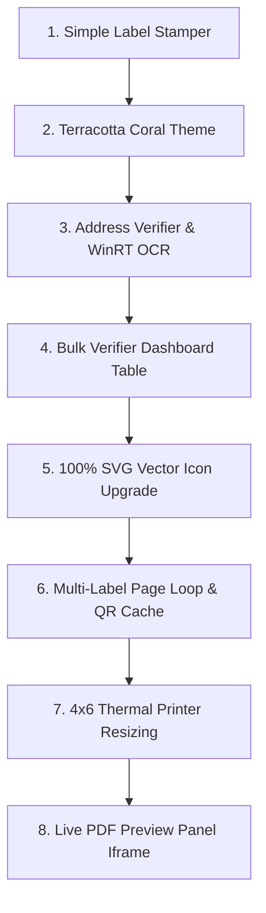

# Ranique Store Toolkit — Project Brain & Session Log

This document serves as the central source of truth for the **Ranique Store Toolkit** architecture, development history, and current session state. If the system crashes or the AI agent context is reset, this file provides the exact instructions to resume development.

---

## 🧭 Project Overview
The Ranique Store Toolkit is a high-performance, 100% local, split-view web application built for **Ranique Lifestyle** to manage e-commerce orders, print shipping labels, and verify address validity.

It consists of two main utilities:
1.  **🏷️ Label Stamper:** Stems store branding (store storefront icon, name, and scannable social link QR code) onto the free bottom space of label PDFs. Supports multi-page batch labels, 4"x6" direct thermal print resizing, and real-time interactive previews.
2.  **📍 Address Verifier:** Runs local WinRT OCR (offline) and post-postal regex matching to verify destination PIN codes, cross-reference state/district databases, detect courier routes, and build a shipping recommendation table.

---

## 🛠️ Complete Development Flow (Chronological Milestones)



### 1. Simple Label Stamper (Base Overlay)
*   **Goal:** Overlay a custom branding strip onto Meesho labels.
*   **Result:** Utilized PyMuPDF to draw a 62-point height vector banner at the bottom of the PDF. Added a storefront SVG-like icon, store name text auto-sizing, and a custom QR code (pointing to a custom URL).

### 2. Terracotta Coral Theme (Modern Dribbble Light Mode)
*   **Goal:** Redesign interface to feel premium, editorial, and clean.
*   **Result:** Shifted from dark mode to a sand off-white background (`#f6f6f8`), pure white glassmorphic cards (`#ffffff`), slate borders (`#e2e8f0`), deep charcoal text (`#1a1d24`), and vibrant burnt terracotta accent brand coloring (`#ee7540`).

### 3. Address Verifier (Local OCR Engine)
*   **Goal:** Verify recipient addresses locally without sending data to external cloud APIs.
*   **Result:** Wrote a PowerShell WinRT OCR pipeline (`win_ocr.ps1`) executing Windows' native `Windows.Media.Ocr.OcrEngine` locally. Extracted destination PIN codes, verified state/district correctness, and generated a deliverability decision.

### 4. Bulk Verifier Dashboard Table
*   **Goal:** Verify multiple PDF files and screenshots at once.
*   **Result:** Updated verifier file inputs to support `multiple` file selections. Created a batch verifier loop in `app.js` and rendered a dynamic master summary table showing PIN, Matches, Hub, Courier, Recommendation, and Reason. Added a "Copy All Safe Addresses" clipboard exporter.

### 5. 100% SVG Vector Icon Upgrade
*   **Goal:** Remove emojis and text arrows to preserve design consistency.
*   **Result:** Replaced all emojis (`🏷️`, `📍`, `🟢`, `🟡`, `🔴`, `📋`, `🔄`, `→`) inside navigation tabs, control buttons, action bar, success feedback alerts, and verification result columns with clean vector inline SVG elements.

### 6. Multi-Label Stamping Page Loop & QR Cache
*   **Goal:** Process PDFs containing multiple pages/labels.
*   **Result:** Rewrote `add_store_strip` inside `store_overlay.py` to loop over all pages in the PDF document. Pre-generated the QR code image bytes once outside the loop to optimize execution time, ensuring sub-second processing.

### 7. 4"x6" Direct Thermal Resizing Toggle
*   **Goal:** Scale shipping labels to standard thermal dimensions.
*   **Result:** Added a toggle option to scale A4 or oversized label pages to standard thermal printer dimensions (exactly 4x6 inches, or 288x432 points in PDF coordinates), preserving aspect ratio for direct dispatches.

### 8. Live PDF Preview Panel (Split Screen)
*   **Goal:** Let users verify the stamped labels before downloading.
*   **Result:** Expanded the main form container to `max-width: 1200px` and created a side-by-side split screen. The left column controls the input parameters, and the right column embeds a live PDF `iframe` showing the processed label immediately.

---

## 📂 File Directory & Architecture

```
d:\Ranique Software\
│
├── app.py                # Flask main backend, exposes /api/stamp and /api/verify-address endpoints.
├── store_overlay.py      # PyMuPDF drawing engine. Draws branding footer, caches QR bytes, resizes to 4x6.
├── address_verifier.py   # Address extractor, PIN regex patterns, district database, hub matchers.
├── win_ocr.ps1           # Windows native WinRT OCR PowerShell connector (100% local OCR).
├── start.bat             # Desktop one-click server starter launcher.
│
├── fonts/                # Plus Jakarta Sans TrueType font cache (Downloaded from tokotype repo).
│   ├── PlusJakartaSans-Bold.ttf
│   ├── PlusJakartaSans-SemiBold.ttf
│   └── PlusJakartaSans-Regular.ttf
│
└── static/
    ├── index.html        # Split screen dashboard UI with inline SVG symbols.
    ├── style.css         # Terracotta Coral color tokens, animations, custom scrollbars.
    └── app.js            # Batch file loops, iframe blob updates, clipboard copying logic.
```

---

## 💾 Session Restoration State (Current Checkpoint)

If the system crashes, reload the workspace with this state:

### 1. What was Completed in the Last Session:
*   Implemented the split-screen panel layout for the Label Stamper, separating parameters on the left and live PDF preview on the right.
*   Set `.main` max-width to `1200px` to give side-by-side elements appropriate desktop horizontal space.
*   Integrated an inline browser preview `iframe` pointing directly to the generated PDF object URL.
*   Added post-stamping controls: **Download PDF**, **Fullscreen View** (opens blob in a new tab), and **Reset** (revokes blob URLs and clears input fields).
*   Enlarged the `"Follow our shop"` caption to **`13.0 pt`** and styled it in **Jakarta Sans Bold** in both the PDF overlay generator (`store_overlay.py`) and the mock preview (`style.css`).

### 2. Verified Active Dependencies:
*   Python 3.13
*   `Flask`
*   `PyMuPDF` (pymupdf >= 1.22.0)
*   `qrcode`
*   `Pillow`

### 3. Open Ports / Running Tasks:
*   The Flask application runs locally on Port `5000`: **`http://localhost:5000`**

---

## 🔮 Next Session Roadmap

1.  **Map Integration:** Option to include a Google Maps verification link column next to the delivery hub in the Verifier Dashboard table for quick manual geography checks.
2.  **Address Parsing Model Training:** Refining regex definitions for return address skipping, ensuring store return PINs (e.g. `824124`) are consistently bypassed on all courier structures.
3.  **PDF Crop Helper:** Allow automatic detection of barcode margins to strip excess white background before scaling to 4x6.
