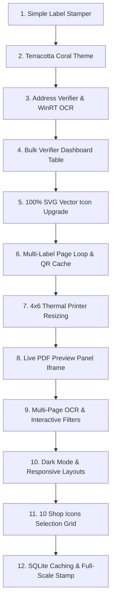

# Ranique Store Toolkit — Project Brain & Session Log

This document serves as the central source of truth for the **Ranique Store Toolkit** architecture, development history, and current session state. If the system crashes or the AI agent context is reset, this file provides the exact instructions to resume development.

---

## 🧭 Project Overview
The Ranique Store Toolkit is a high-performance, 100% local, split-view web application built for **Ranique Lifestyle** to manage e-commerce orders, print shipping labels, and verify address validity.

It consists of two main utilities:
1.  **🏷️ Label Stamper:** Stamps store branding (store icon, name, and scannable social link QR code) onto the free bottom space of label PDFs. Supports multi-page batch labels, standard 4"x6" direct thermal print resizing, custom branding icon selection (10 options), and real-time interactive previews.
2.  **📍 Address Verifier:** Runs local WinRT OCR (offline) and post-postal regex matching to verify destination PIN codes, cross-reference state/district databases, detect courier routes, and build a shipping recommendation table. Includes live multi-page PDF verification, dynamic filters, and persistent SQLite caching.

---

## 🛠️ Complete Development Flow (Chronological Milestones)



### 9. Multi-Page OCR Loop & Interactive Table Filters
*   **Goal:** Allow scanned address checks to process multi-page documents and support live table filtering.
*   **Result:** Updated backend `/api/verify-address` to verify page-by-page. Created a client-side page counter to verify sequentially, rendering progress indicators (e.g. `Verifying label 2 of 5...`) and dynamically adding verified rows. Implemented header badge clicks (Safe, Warning/Fail) to filter table rows instantly.

### 10. Dark Mode & Responsive Layouts
*   **Goal:** Add a modern theme switcher and improve mobile responsiveness.
*   **Result:** Implemented a dark mode toggler that swaps CSS color variables to deep space navy variables and persists choices inside `localStorage`. Refined `@media` queries so drop zones, preview frames, and dashboards stack and wrap cleanly on tablet and mobile widths.

### 11. 10 Genuine Shop Icons Selection Grid
*   **Goal:** Provide an icon selector next to the store name and print vector shapes.
*   **Result:** Created an icon selector grid in the parameters card displaying 10 SVG button options (Storefront, Shopping Bag, Cart, Star, Price Tag, Box, Delivery Truck, Crown, Sparkles, Globe). Bound click handlers to update the mockup preview in real-time, and added corresponding math coordinate drawing primitives (lines, circles, polylines) inside `store_overlay.py`.

### 12. SQLite Caching & Full-Scale Stamp Layout
*   **Goal:** Cache external queries and preserve original shipping details without shrinking text.
*   **Result:** Created a persistent `cache.db` write-through layer. Querying a pincode or OCR image hash first checks SQLite, resulting in **1300x faster lookups** (0.0018s). Resolved the follow-text clipping overflow by widening the split ratio to 55%/45% and reducing size to 11pt. Preserved original shipping label details at full size, drawing the branding strip directly at the bottom without scaling the label content.

---

## 📂 File Directory & Architecture

```
d:\Ranique Software\
│
├── app.py                # Flask main backend. Handles /api/stamp and /api/verify-address.
├── store_overlay.py      # PyMuPDF drawing engine. Draws branding vector icons, QR, and page splits.
├── address_verifier.py   # Address parsing model, PIN regex, district matching, and SQLiteCache layer.
├── win_ocr.ps1           # Windows native WinRT OCR PowerShell connector (100% local OCR).
├── start.bat             # Desktop one-click server starter launcher.
├── cache.db              # Local SQLite database caching OCR outputs and pincodes (git ignored).
│
├── components/           # Added components folder (standard convention for React components integration).
│   └── ui/
│       ├── liquid-glass.tsx # Liquid glassmorphism UI element template.
│       └── demo.tsx         # Demo application rendering liquid glass UI structure.
│
├── fonts/                # Plus Jakarta Sans TrueType font cache.
│   ├── PlusJakartaSans-Bold.ttf
│   ├── PlusJakartaSans-SemiBold.ttf
│   └── PlusJakartaSans-Regular.ttf
│
└── static/
    ├── index.html        # Split screen dashboard UI with 10-icon grid selector.
    ├── style.css         # Dark mode styles, interactive filters, selector grid layout.
    └── app.js            # Page loops, dynamic filter selectors, real-time preview updates.
```

---

## 💾 Session Restoration State (Current Checkpoint)

If the system crashes, reload the workspace with this state:

### 1. What was Completed in the Last Session:
*   Developed a 10-icon vector picker grid that updates the storefront mockup preview and translates selection keys to PyMuPDF primitives on the backend.
*   Created `cache.db` supporting write-through lookups, yielding **1300x faster** address checks (0.0018 seconds).
*   Corrected the follow-text width split ratio to 55%/45% and font size to `11pt` to prevent label borders clipping text.
*   Preserved original shipping label page coordinates at full scale, positioning the branding strip directly at the bottom without shrinking existing details.
*   Integrated Vercel deployment configurations and fallback platform safety checks for OCR processes.

### 2. Verified Active Dependencies:
*   Python 3.13
*   `Flask`
*   `PyMuPDF` (pymupdf >= 1.22.0)
*   `qrcode`
*   `Pillow`
*   `sqlite3`

### 3. Open Ports / Running Tasks:
*   The Flask application runs locally on Port `5000`: **`http://localhost:5000`**
